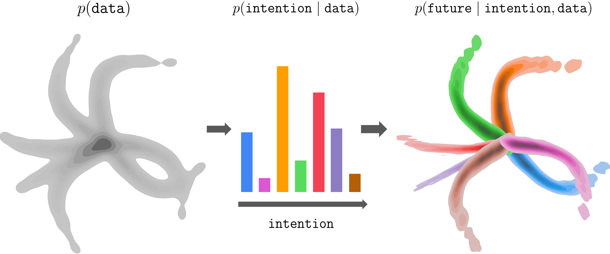
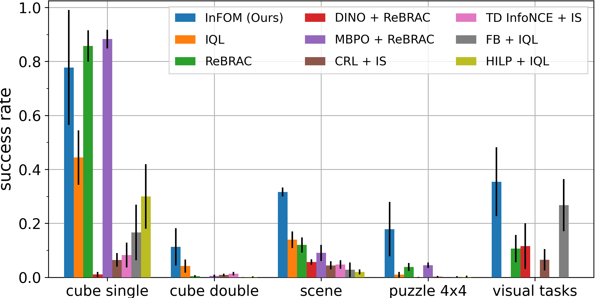
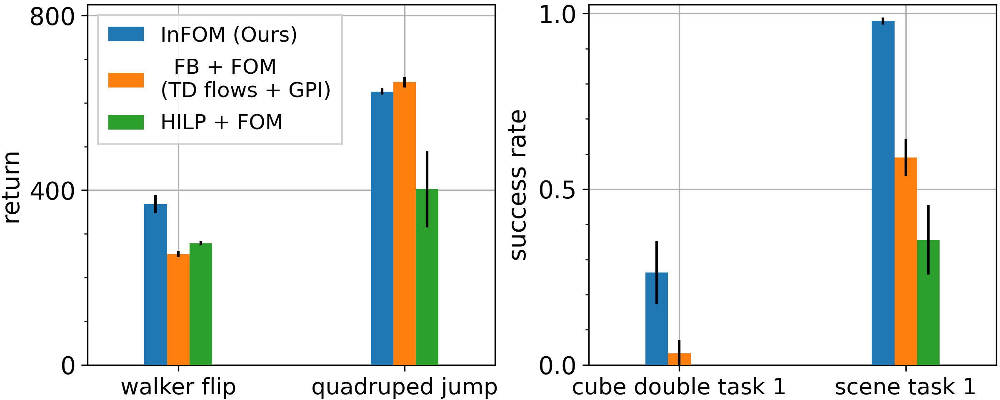
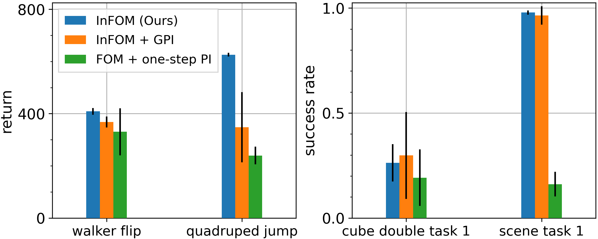

<p><center><a href="https://chongyi-zheng.github.io">Chongyi Zheng</a>, &emsp; <a href="https://seohong.me/">Seohong Park</a>, &emsp; <a href="https://people.eecs.berkeley.edu/~svlevine">Sergey Levine</a>, &emsp; <a href="https://ben-eysenbach.github.io">Benjamin Eysenbach</a></center></p>
<p><center><b><a href="" style="font-size: 20px">Paper</a>, &emsp; <a href="https://github.com/chongyi-zheng/infom" style="font-size: 20px">Code</a></b></center></p>

<p align="center">
<br>

</p>

### Overview

Intention-Conditioned Flow Occupancy Models (**InFOM**) is a latent variable model for pre-training and fine-tuning in reinforcement learning. *(Left)* The datasets are collected by users performing distinct tasks. *(Center)* We encode intentions by maximizing an evidence lower bound of data likelihood, *(Right)* enabling intention-aware future prediction using flow matching.


### Ideas

Our latent variable model simultaneously encodes user intentions and predicts temporal distant future. 

__Pre-training__
- Given *reward-free* pre-training datasets $$D$$ containing consecutive state-action pairs $$(s, a, s', a')$$ and a future state from the same trajectory $$s_f$$, we infer the latent intention $$z \in \mathcal{Z}$$ using the encoder $$p_e(z \mid s', a')$$ and predict the occupancy measures of the future state $$s_f$$ using the occupancy models $$q_d(s_f \mid s, a, z)$$. 
- We maximize an evidence lower bound (ELBO) of the data likelihood to jointly optimize the encoder $$p_e(z \mid s', a')$$ and the decoder $$q_d(s_f \mid s, a, z)$$ using flow matching:

    $$
    \max_{p_e, q_d} \mathcal{L}_{\mathrm{Flow}}(q_d, p_e) + \lambda \mathbb{E}_{(s', a') \sim D} \left[ D_{\mathrm{KL}}( p_e(z \mid s', a') \parallel p(z) ) \right],
    $$

    where $$p(z) = \mathcal{N}(0, I)$$ denotes an uninformative Gaussian prior.

- To predict future states across trajectories (dynamic programming), we adopt the SARSA variant of the TD flow loss [(Farebrother et al.)](https://arxiv.org/abs/2503.09817) to learn the vector field $$v_d: [0, 1] \times \mathcal{S} \times \mathcal{S} \times \mathcal{A} \times \mathcal{Z} \to \mathcal{S}$$ of our flow occupancy models:

    $$
    \begin{align*}
    \mathcal{L}_{\text{SARSA flow}}(v_d, p_e) &= (1 - \gamma) \mathcal{L}_{\text{SARSA current flow}}(v_d, p_e) + \gamma \mathcal{L}_{\text{SARSA future flow}}(v_d, p_e), \\ 
    \mathcal{L}_{\text{SARSA current flow}}(v_d, p_e)&: \text{reconstruct the current state $s$}, \\
    \mathcal{L}_{\text{SARSA future flow}}(v_d, p_e)&: \text{bootstrap the future state $s_f$}.
    \end{align*}
    $$

__Fine-tuning__
- The flow occupancy models allow us to estimate a set of intention-conditioned Q functions on *reward-labeled* datasets $$D_{\text{reward}}$$ during fine-tuning.

$$
\hat{Q}(s, a, z) = \frac{1}{(1 - \gamma) N} \sum_{i = 1}^N r \left( s_f^{(i)} \right), \, s_f^{(i)} \sim q_d(s_f \mid s, a, z), \forall \: (s, a) \in D_{\text{reward}}, \: z \in \mathcal{Z}
$$

- We then utilize an implicit generalized policy improvement procedure to extract a policy.

    $$
    \begin{align*}
    \mathcal{L}(Q) &= \mathbb{E}_{(s, a) \sim D_{\text{reward}}, \: z \sim p(z) } \left[ L_2^{\mu} \left( Q(s, a) -  \hat{Q}(s, a, z) \right) \right], \\
    \mathcal{L}(\pi) &= -\mathbb{E}_{(s, a) \sim D_{\text{reward}}, a^{\pi} \sim \pi(a^{\pi} \mid s)} [Q(s, a^{\pi}) + \alpha \log \pi(a \mid s)],
    \end{align*}
    $$

    where $$L_2^{\mu}(x) = \lvert \mu - \mathbb{1}(x < 0) \rvert x^2$$ is the expectile loss with $$\mu \in [0.5, 1)$$ and $$\alpha$$ controls the behavioral cloning regularization strength.


### Domains

<div style="display:flex; justify-content:center; gap:1rem; margin:1.5em 0;">
  <figure style="margin:0; text-align:center;">
    
    <figcaption style="font-size:1.2rem;">cheetah</figcaption>
  </figure>
  <figure style="margin:0; text-align:center;">
    
    <figcaption style="font-size:1.2rem;">walker</figcaption>
  </figure>
  <figure style="margin:0; text-align:center;">
    
    <figcaption style="font-size:1.2rem;">quadruped</figcaption>
  </figure>
  <figure style="margin:0; text-align:center;">
    
    <figcaption style="font-size:1.2rem;">jaco</figcaption>
  </figure>
</div>

<div style="display:flex; justify-content:center; gap:1rem; margin:1.5em 0;">
  <figure style="margin:0; text-align:center;">
    
    <figcaption style="font-size:1.2rem;">cube single</figcaption>
  </figure>
  <figure style="margin:0; text-align:center;">
    
    <figcaption style="font-size:1.2rem;">cube double</figcaption>
  </figure>
  <figure style="margin:0; text-align:center;">
    
    <figcaption style="font-size:1.2rem;">scene</figcaption>
  </figure>
  <figure style="margin:0; text-align:center;">
    
    <figcaption style="font-size:1.2rem;">puzzle 4x4</figcaption>
  </figure>
</div>

We select four domains from the [ExORL](https://arxiv.org/abs/2201.13425) benchmarks: $$\texttt{cheetah}$$, $$\texttt{walker}$$, $$\texttt{quadruped}$$, $$\texttt{jaco}$$, including 16 state-based tasks, and four domains from the [OGBench](https://arxiv.org/abs/2410.20092) benchmarks: $$\texttt{cube single}$$, $$\texttt{cube double}$$, $$\texttt{scene}$$, $$\texttt{puzzle 4x4}$$, including 20 state-based tasks and 4 image-based tasks, to evaluate our algorithms.

### Evaluation on ExORL and OGBench tasks

<p align="center" style="margin:1.5em 0;">
    
    
</p>

- We compare InFOM to eight baselines learning different models, measuring the performance on downstream tasks after fine-tuning. The models learned by those methods include behavioral cloning policies, transition models,
representations, classifiers that predict occupancy measures, and latent intentions along with intention-conditioned policies (skills).

- InFOM matches or surpasses all baselines on six out of eight domains. On those more challenging state-based manipulation tasks from OGBench, we find a marked difference between baselines and InFOM. We conjecture that the baselines failed on these more challenging tasks because of the *semi-sparse* reward functions, while our method learns an expressive generative model along with the GPI-like policy extraction strategy to better exploit the high-reward region of the state space.

### Ablation study

__Comparison to prior intention encoding mechanisms__

<p align="center" style="margin:1.5em 0;">
    
</p>

Comparing to prior intention encoding mechanisms based on unsupervised skill discovery (HILP + FOM) or successor feature learning (FB + FOM), InFOM is a simple and performant way to infer user intentions.

__Comparison to alternative policy extraction strategies__

<p align="center" style="margin:1.5em 0;">
    
</p>

Comparing InFOM to alternative policy extraction strategies based on the standard generalized policy improvement or the one-step policy improvement, our proposed method is more efficient ($$44\%$$ higher performance on average) and robust ($$8 \times$$ smaller variance).

### Citation

```bibtex
@article{zheng2025intention,
    title={Intention-Conditioned Flow Occupancy Models},
    author={Chongyi Zheng and Seohong Park and Sergey Levine and Benjamin Eysenbach},
    journal={arXiv preprint arXiv:xxx},
    year={2025}
}
```
