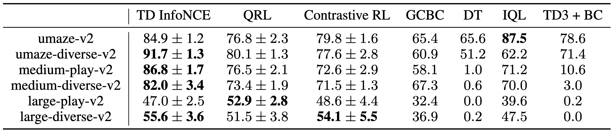
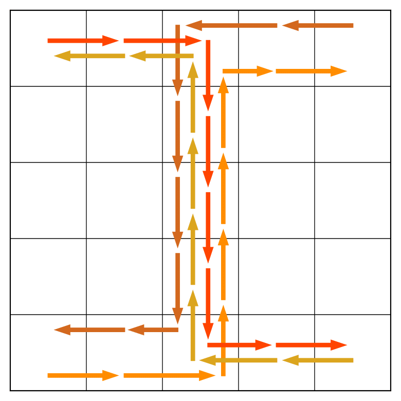
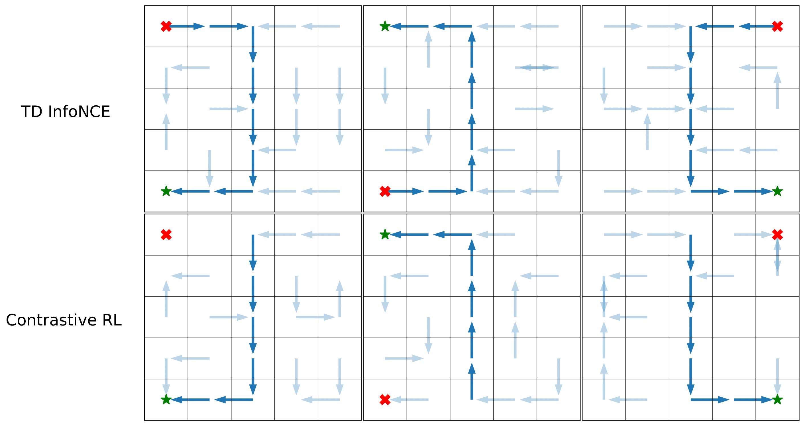
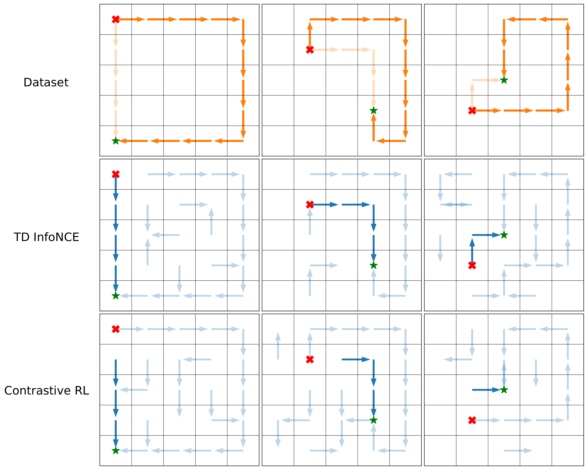

<a href="https://chongyi-zheng.github.io/">Chongyi Zheng</a>, &emsp; <a href="https://www.cs.cmu.edu/~rsalakhu/">Ruslan Salakhutdinov</a>, &emsp; <a href="https://ben-eysenbach.github.io/">Benjamin Eysenbach</a>

<b><a href="">Paper</a>, &emsp; <a href="https://github.com/chongyi-zheng/td_infonce">Code</a></b>

*__Abstract__*:
Predicting and reasoning about the future lies at the heart of many time-series questions. For example, goal-conditioned reinforcement learning can be viewed as learning representations to predict which states are likely to be visited in the future. While prior methods have used contrastive predictive coding to model time series data, learning representations that encode long-term dependencies usually requires large amounts of data. In this paper, we introduce a temporal difference version of contrastive predictive coding that stitching together pieces of different time series data to decrease the amount of data required to learn to predict future events. We apply this representation learning method to derive an off-policy algorithm for goal-conditioned RL. Experiments demonstrate that, compared with prior RL methods, ours achieves higher success rates with less data, and can better cope with stochastic environments.

### Evaluation on online GCRL benchmarks

**TASK:** reach

    

        
    

    

        
    

    

        
    

**TASK:** push

    

        
    

    

        
    

    

        
    

**TASK:** pick and place

    

        
    

    

        
    

    

        
    

**TASK:** slide

    

        
    

    

        
    

    

        
    

### Evaluation on offline goal reaching

offline D4RL AntMaze benchmarks

    

### Off-policy reasoning

**Stitching trajectories in a dataset:** The behavioral policy collects "Z" style trajectories. 

    

Unlike the Monte Carlo method (contrastive RL) , our TD InfoNCE successfully "stitches'' these trajectories together, navigating between pairs of (start - red cross, goal - green star) states unseen in the training trajectories.

    

**Searching for shortcuts in skewed datasets:** Conditioned on different initial states (red cross) and goals (green star), we collect datasets with 95% long paths (dark) and 5% short paths (light). TD InfoNCE infers the shortest path, while contrastive RL fails to find this path.

    

